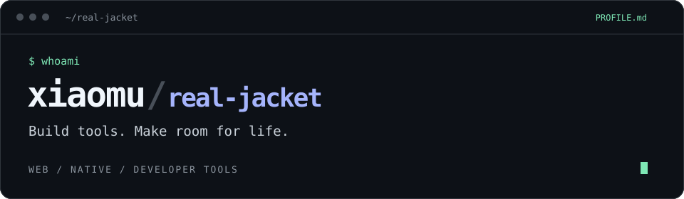

<p align="center">
  
</p>

<p align="center">
  <a href="#now">当前关注</a> ·
  <a href="#next">未来探索</a> ·
  <a href="#stack">技术栈</a> ·
  <a href="https://github.com/real-jacket/real-jacket/issues">聊聊想法 ↗</a>
</p>

从前端出发，把想法做成自己每天愿意使用的工具。

我是 **xiaomu**，一名前端开发者，正在把探索延伸到原生应用、全栈工程与 AI 辅助开发。喜欢打磨交互，也喜欢研究工具背后的原理，希望用代码让工作更高效、生活更轻松。

```yaml
handle: real-jacket
focus: [web engineering, native apps, developer tools]
motivation: 把麻烦留给代码，把时间还给生活
```

<a id="now"></a>
### 01 / Current focus

- **Web Engineering** — 前端架构、类型系统与工程化，持续探索复杂应用的开发体验与可维护性。
- **Native Experience** — SwiftUI 与 Apple 生态，关注自然的交互、细腻的动效和一致的使用体验。
- **Developer Productivity** — CLI、自动化与 AI 辅助开发，让工具融入日常工作，减少重复劳动。

<a id="next"></a>
### 02 / Exploring next

```text
→ Agent workflows     探索人与 Agent 协作的开发方式
→ Local-first         关注数据自主、隐私与离线体验
→ Cross-platform      寻找 Web、桌面与原生体验之间的连接
→ Full-stack systems  从界面延伸到服务、数据与部署
```

希望继续探索 AI 与软件工程的结合，做出更自然、更可靠的个人工具，也让好的实践更容易被复用。

<a id="stack"></a>
### 03 / Toolbox

```text
Web       TypeScript · React · Next.js · Node.js
Native    Swift · SwiftUI · SwiftData
Desktop   Electron
Delivery  Docker · GitHub Actions · NAS
Workflow  Codex · Claude Code · CLI · Skills
```

### 04 / How I build

- **从真实问题开始。** 优先做自己会用、能减少重复操作的工具。
- **让 AI 进入工作流。** 用 Agent 辅助实现，把判断、审查和验证留在工程闭环里。
- **对体验较真。** 关心加载、空状态、动效和异常路径，也关心数据是否准确。
- **把交付做完整。** 从界面到存储，从本地运行到构建、部署与回归验证。

### 05 / Coding lately

<details>
<summary>展开最近的编码时间 · WakaTime</summary>

<!--START_SECTION:waka-->

```txt
From: 24 September 2026 - To: 01 October 2026

Swift        18 hrs 40 mins        ████████████▒░░░░░░░░░░░░   49.08 %
Markdown     7 hrs 25 mins         █████░░░░░░░░░░░░░░░░░░░░   19.50 %
Other        7 hrs 20 mins         ████▓░░░░░░░░░░░░░░░░░░░░   19.28 %
Text         1 hr 37 mins          █░░░░░░░░░░░░░░░░░░░░░░░░   04.27 %
TypeScript   1 hr 31 mins          █░░░░░░░░░░░░░░░░░░░░░░░░   04.02 %
```

<!--END_SECTION:waka-->

</details>

---

欢迎交流 **前端工程、SwiftUI、开发工具和 AI 辅助开发**。
有想法、有问题，或者也在做让生活更方便的小工具 → **[开个 Issue 聊聊](https://github.com/real-jacket/real-jacket/issues)**。
