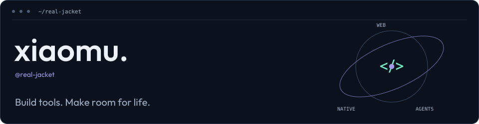

<picture>
  <source media="(prefers-reduced-motion: reduce) and (max-width: 600px)" srcset="./assets/orbit-vector-mobile-still.svg" />
  <source media="(prefers-reduced-motion: reduce)" srcset="./assets/orbit-vector-still.svg" />
  <source media="(max-width: 600px)" srcset="./assets/orbit-vector-mobile.svg" />
  
</picture>

**English** | [简体中文](./README.zh-CN.md)

### Hi, I'm xiaomu.

With a background in frontend development, I'm also exploring native apps and AI-assisted development. I enjoy refining interactions, scripting repetitive tasks, and building tools I want to use every day.

### Current interests

- **Web engineering** — Exploring frontend architecture, type systems, and tooling to keep complex applications and development workflows clear.
- **Native experiences** — Exploring SwiftUI and the Apple ecosystem, with a focus on natural interactions and thoughtful motion.
- **Developer productivity** — Using CLIs, automation, and AI to improve my workflow and let tools handle repetitive work.

### What's next

- **Agent workflows** — Finding better ways to collaborate with AI agents while keeping review and verification part of the process.
- **Local-first** — Building tools that respect privacy, work offline, and keep me in control of my data.
- **Cross-platform & full-stack** — Going deeper into services, data, and deployment, and exploring connections between web, desktop, and native apps.

### Tools I use

**Web** · TypeScript · React · Next.js · Node.js<br />
**Native & Desktop** · Swift · SwiftUI · SwiftData · Electron<br />
**Workflow & Delivery** · Codex · Claude Code · CLI · Docker · GitHub Actions

### Recent coding activity

<!--START_SECTION:waka-->

```txt
From: 30 September 2026 - To: 07 October 2026

No activity tracked
```

<!--END_SECTION:waka-->

If you enjoy exploring these areas too, [let's talk](https://github.com/real-jacket/real-jacket/issues).
