<picture>
  <source media="(max-width: 600px)" srcset="./assets/console-compact-mobile.svg" />
  
</picture>

**从前端出发，探索软件的更多可能。**<br />
关注 Web 工程、原生体验与 AI 辅助开发。打磨交互，自动化重复劳动，做自己愿意每天使用的工具。

| 现在 · Focus | 接下来 · Explore |
| :--- | :--- |
| **⌘ Web Engineering**<br />前端架构、类型系统与工程化 | **↗ Agent Workflows**<br />人与 Agent 协作开发、审查与验证 |
| **◈ Native Experience**<br />SwiftUI、Apple 生态与交互体验 | **◎ Local-first**<br />隐私、离线能力与数据自主 |
| **⚙ Developer Productivity**<br />CLI、自动化与 AI 辅助开发 | **⤴ Cross-platform & Full-stack**<br />连接 Web、原生、服务与部署 |

`TypeScript` `React` `Next.js` `Swift` `SwiftUI` `Electron`

<details>
<summary>⌘ 更多工具与工作流</summary>

`Node.js` `SwiftData` `Codex` `Claude Code` `CLI` `Docker` `GitHub Actions`

</details>

<details>
<summary>◷ 编码近况 · WakaTime</summary>

<!--START_SECTION:waka-->

```txt
From: 25 September 2026 - To: 02 October 2026

Swift        13 hrs 36 mins        ███████████▒░░░░░░░░░░░░░   44.98 %
Other        7 hrs 18 mins         ██████░░░░░░░░░░░░░░░░░░░   24.17 %
Markdown     5 hrs 59 mins         █████░░░░░░░░░░░░░░░░░░░░   19.81 %
TypeScript   1 hr 31 mins          █▒░░░░░░░░░░░░░░░░░░░░░░░   05.06 %
JavaScript   55 mins               ▓░░░░░░░░░░░░░░░░░░░░░░░░   03.06 %
```

<!--END_SECTION:waka-->

</details>

<sub>保持好奇，持续构建。</sub> &nbsp; **[聊聊下一个想法 ↗](https://github.com/real-jacket/real-jacket/issues)**
