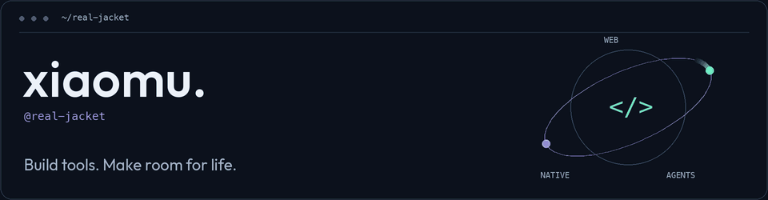

<picture>
  <source media="(prefers-reduced-motion: reduce) and (max-width: 600px)" srcset="./assets/profile-orbit-mobile.png" />
  <source media="(prefers-reduced-motion: reduce)" srcset="./assets/profile-orbit.png" />
  <source media="(max-width: 600px)" srcset="./assets/profile-orbit-mobile.gif" />
  
</picture>

### 从前端出发，探索软件的更多可能。

我是 **xiaomu**。关注 Web 工程、原生体验与 AI 辅助开发。喜欢打磨交互、自动化重复劳动，做自己愿意每天使用的工具。

### 当前关注

- **Web 工程** — 前端架构、类型系统与工程化，让复杂应用和开发过程保持清晰。
- **原生体验** — SwiftUI 与 Apple 生态，打磨自然的交互和细腻的动效。
- **开发效率** — CLI、自动化与 AI 辅助开发，把时间留给值得思考的问题。

### 未来探索

- **Agent 工作流** — 探索人与 Agent 如何共同完成开发、审查与验证。
- **Local-first** — 关注隐私、离线能力，以及对个人数据的掌控。
- **跨平台与全栈** — 连接 Web、桌面、原生应用，继续向服务、数据与部署深入。

### 技术与工具

**Web** &nbsp; TypeScript · React · Next.js · Node.js<br />
**Native & Desktop** &nbsp; Swift · SwiftUI · SwiftData · Electron<br />
**Workflow & Delivery** &nbsp; Codex · Claude Code · CLI · Docker · GitHub Actions

### 编码近况

<!--START_SECTION:waka-->

```txt
From: 25 September 2026 - To: 02 October 2026

Swift        13 hrs 36 mins        ███████████▒░░░░░░░░░░░░░   44.98 %
Other        7 hrs 18 mins         ██████░░░░░░░░░░░░░░░░░░░   24.17 %
Markdown     5 hrs 59 mins         █████░░░░░░░░░░░░░░░░░░░░   19.81 %
TypeScript   1 hr 31 mins          █▒░░░░░░░░░░░░░░░░░░░░░░░   05.06 %
JavaScript   55 mins               ▓░░░░░░░░░░░░░░░░░░░░░░░░   03.06 %
```

<!--END_SECTION:waka-->

保持好奇，持续构建。 &nbsp; [聊聊下一个想法](https://github.com/real-jacket/real-jacket/issues)
