<picture>
  <source media="(max-width: 600px)" srcset="./assets/profile-header-mobile.svg" />
  
</picture>

<p align="center">
  <a href="#focus">Focus</a> &nbsp; / &nbsp;
  <a href="#next">Next</a> &nbsp; / &nbsp;
  <a href="#toolbox">Toolbox</a> &nbsp; / &nbsp;
  <a href="https://github.com/real-jacket/real-jacket/issues">Say hello ↗</a>
</p>

### 从前端出发，探索软件的更多可能。

我是 **xiaomu**。关注 Web 工程、原生体验与 AI 辅助开发，喜欢把复杂问题拆开，把重复操作自动化，再把交互打磨得顺手一点。

**写有用的代码，做自己愿意每天使用的工具。**

<br />

<a id="focus"></a>
### `01` / Focus

**⌘ &nbsp; Web Engineering**<br />
前端架构、类型系统与工程化。关心复杂应用如何保持清晰，也关心开发过程是否顺畅。

**◈ &nbsp; Native Experience**<br />
SwiftUI 与 Apple 生态。探索自然的交互、细腻的动效，以及软硬件之间恰到好处的配合。

**↗ &nbsp; Developer Productivity**<br />
CLI、自动化与 AI 辅助开发。让工具融入工作流，把时间留给值得思考的问题。

<br />

<a id="next"></a>
### `02` / Next horizon

> 感兴趣的下一站：更自主的数据、更自然的交互，以及更高效的人机协作。

- **Agent workflows** &nbsp; / &nbsp; 探索人与 Agent 如何共同完成开发、审查与验证。
- **Local-first** &nbsp; / &nbsp; 关注隐私、离线能力和对个人数据的掌控。
- **Cross-platform** &nbsp; / &nbsp; 寻找 Web、桌面与原生体验之间的连接。
- **Full-stack systems** &nbsp; / &nbsp; 从界面继续向服务、数据和部署深入。

<br />

<a id="toolbox"></a>
### `03` / Toolbox

**Web** &nbsp; `TypeScript` `React` `Next.js` `Node.js`<br />
**Native & Desktop** &nbsp; `Swift` `SwiftUI` `SwiftData` `Electron`<br />
**Workflow & Delivery** &nbsp; `Codex` `Claude Code` `CLI` `Docker` `GitHub Actions`

<details>
<summary><b>◷ &nbsp; Coding telemetry</b> · 最近的编码时间</summary>

<!--START_SECTION:waka-->

```txt
From: 25 September 2026 - To: 02 October 2026

Swift        13 hrs 36 mins        ███████████▒░░░░░░░░░░░░░   44.98 %
Other        7 hrs 18 mins         ██████░░░░░░░░░░░░░░░░░░░   24.17 %
Markdown     5 hrs 59 mins         █████░░░░░░░░░░░░░░░░░░░░   19.81 %
TypeScript   1 hr 31 mins          █▒░░░░░░░░░░░░░░░░░░░░░░░   05.06 %
JavaScript   55 mins               ▓░░░░░░░░░░░░░░░░░░░░░░░░   03.06 %
```

<!--END_SECTION:waka-->

</details>

---

<sub>保持好奇，持续构建。 / Stay curious. Keep building.</sub>

**[聊聊技术，也聊聊下一个想法 ↗](https://github.com/real-jacket/real-jacket/issues)**
